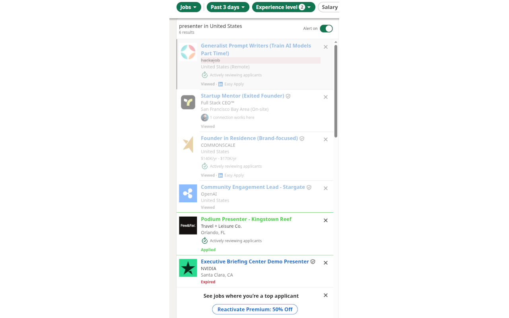
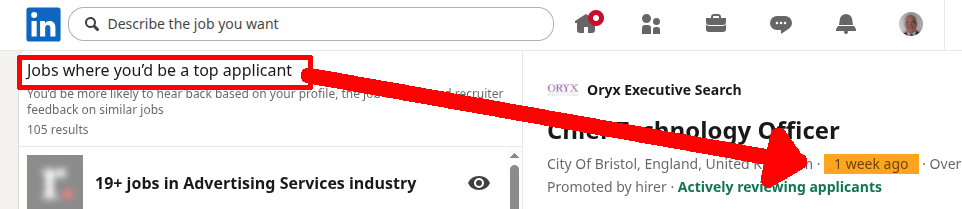

# LinkedIn Job Ad Marker

---

LinkedIn Job Ad Marker is an extension available for Chrome and Firefox applied solely on LinkedIn job search pages. It helps you work through large job lists faster by marking adverts you have already seen, jobs you have applied for, companies you do not want to deal with, and older listings you may want to skip.

The aim is simple: reduce repeat scanning. Instead of re-reading the same cards every time LinkedIn reshuffles, reloads, or promotes old listings again, the extension adds lightweight visual cues directly to the job list.

- **Chrome**: https://chromewebstore.google.com/detail/linkedin-job-ad-marker/eaegndbkfnnkmcedmhpdiiombakchjbe
- **FireFox**: Will be here: https://addons.mozilla.org/en-US/firefox/addon/linkedin-job-ad-marker/

## What It Does

On supported LinkedIn job pages, the extension scans job cards, extracts job identity where available, and compares that against locally stored data.

It then applies visual marks:

- `Viewed`: the card is faded with reduced opacity
- `Applied`: the card gets a green outline
- `Blacklisted company`: the company line gets a reddish background and strikethrough
- `Ageing`: LinkedIn publish-age tokens can be highlighted in orange when they are older than your configured threshold
- `Unwanted title`: cards whose title contains a configured word or phrase are struck through with a red double underline

Blacklisted companies and unwanted titles are independent of job state, so a card can be both `Applied` and struck through, or `Viewed` and `Blacklisted`.

On supported LinkedIn jobs layouts, the ageing rule can mark:

- the publish date in the left-hand card list when LinkedIn exposes `time[datetime]`
- the relative age token in the left-hand AI-generated search cards, such as `4 days ago`
- the relative age token in the right-hand details panel, such as `2 weeks ago`

## How Viewed Jobs Are Tracked

The extension currently records a job as `viewed` when LinkedIn navigates to a specific job in the job details pane and the URL contains a `currentJobId`.

It also respects LinkedIn’s own `Viewed` badge on cards. If a card already shows LinkedIn’s `Viewed` state and the extension has no local record yet, it stores that as `viewed` as well.

## Context Menu Actions

Right-clicking on a LinkedIn jobs page gives you these actions:

- `Toggle company blacklist`
- `Toggle marker`
- `Mark as applied`
- `Options`

`Toggle marker` is a session-level kill switch. It removes all visual marks until you enable the marker again.

`Options` opens the extension options page in a new tab.

## Options Page

The options page lets you configure a small set of extension settings stored in `chrome.storage.sync`:

- debug logging on/off
- ageing limit in days
- treat Promoted and Reposted as Viewed
- unwanted title words (comma-separated)
- viewed opacity
- applied colour
- blacklisted colour

It also provides:

- `Save`
- `Cancel`
- `Export`
- `Import`
- `Close`

Colour and ageing changes are applied live to LinkedIn pages, so a page reload is not required.

`Ageing limit (days)` accepts values from `1` to `7`. Any other value is treated as disabled and shown as `(disabled)` in the options page while remaining editable.

## Export and Import

The options page can export a JSON file containing:

- extension version
- saved options
- blacklisted companies
- stored jobs, if a LinkedIn tab is open and reachable

Import restores the same structure. Job imports preserve the stronger state, so an older backup cannot downgrade an `applied` record back to `viewed`.

## Storage

The extension uses two browser storage layers:

### IndexedDB

Database: `li-job-marker`
Store: `jobs`

Each record contains:

- `id`: LinkedIn job ID
- `type`: `viewed` or `applied`
- `timestamp`: when the record was saved

### `chrome.storage.sync`

Used for:

- options
- blacklisted companies

This means settings and blacklist data can follow the signed-in browser profile, subject to Chrome sync behaviour.

## Where It Runs

The extension injects on:

- `https://www.linkedin.com/*`

It then activates its job-marking logic only when the current page is part of LinkedIn Jobs.

This broader match is intentional, because LinkedIn often moves into job pages through SPA navigation rather than a full page load.

## Privacy

All data stays in your browser. Nothing is sent to, shared with, or stored by any third party.

> [!NOTE]
> Job lists opened from email links (such as job alert emails) are snapshots generated at send time. The relative age text shown on each card (e.g. `1 day ago`) reflects the time of generation, **not the time of viewing**. If you open such a link a day or more after the email was sent, the displayed age will be behind the actual calendar date. For example, a card showing `1 day ago` may have a `datetime` attribute of two days prior, causing the ageing mark to appear earlier than expected.
